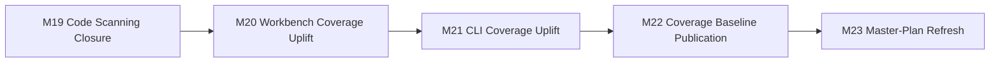

# Roadmap Next (M19-M23)

Updated: 2026-03-10

## Objective

Move the repo from "feature-complete for M14-M18" to "quality-defensible for the next wave":
- close fresh CodeQL regressions quickly,
- raise unit coverage where the execution surface is still under-tested,
- publish an auditable coverage baseline instead of relying on ad hoc local runs,
- align the master plan and roadmap with the real post-M18 quality backlog.

## Traceability

| Milestone | Issue | Status |
| --- | --- | --- |
| `M19` | `#45` | `DONE` |
| `M20` | `#44` | `DONE` |
| `M21` | `#47` | `DONE` |
| `M22` | `#43` | `DONE` |
| `M23` | `#46` | `DONE` |

## M19: Code Scanning Closure

Goal: remove newly introduced CodeQL regressions before they become backlog noise.
Status: `DONE`

Scope:
1. fix the open workbench test-helper correctness alert,
2. re-run CodeQL on `main`,
3. keep the change local to test helpers unless production code is actually implicated.

Delivered:
1. `flattenText` in `packages/workbench/src/appBehavior.test.tsx` no longer relies on the flagged null-comparison pattern,
2. CodeQL was re-triggered on `main` after the fix landed,
3. the milestone is complete from repo state; GitHub alert closure now depends only on workflow completion.

## M20: Workbench Coverage Uplift

Goal: raise confidence in the interactive browser runtime without weakening thresholds.
Status: `DONE`

Scope:
1. expand `RecipeEditor` interaction coverage,
2. expand worker-pool edge-case coverage,
3. keep tests deterministic and runner-friendly.

Delivered:
1. `RecipeEditor` coverage now includes arg editing and invalid move-direction behavior,
2. `WorkerPoolClient` coverage now includes dispose rejection paths, stats, `cancelQueued(false)`, and no-retry-on-abort behavior,
3. package coverage improved to `84.01%` statements / `88.81%` functions.

## M21: CLI Coverage Uplift

Goal: cover the highest-value command-surface branches in `main.ts`.
Status: `DONE`

Scope:
1. add direct tests for dense option parsing,
2. add failure-path tests for invalid CLI values,
3. cover list/report/trace/repro execution branches.

Delivered:
1. `parseArgs` now has coverage for trace, repro, batch, output, and encoding flags,
2. direct tests now exercise invalid option values and unknown-flag exits,
3. CLI execution tests now cover summary/trace/repro output and JSON op listing,
4. package coverage improved to `76.90%` statements / `50.00%` functions.

## M22: Coverage Baseline Publication

Goal: make quality work auditable and reproducible from repo docs.
Status: `DONE`

Scope:
1. publish current package coverage numbers,
2. identify hotspot files and blocking thresholds,
3. record the exact validation commands used.

Delivered:
1. new coverage baseline report added in `docs/parity/quality-coverage-baseline.md`,
2. hotspot files and current blockers are captured with concrete package-level metrics,
3. validation commands are documented for replay.

## M23: Master-Plan and Roadmap Refresh

Goal: remove roadmap drift after the M19-M23 quality wave.
Status: `DONE`

Scope:
1. publish a new roadmap for the next five milestones,
2. link milestones to GitHub issues,
3. update index/master-plan references.

Delivered:
1. this roadmap defines the M19-M23 series end-to-end,
2. `docs/index.md` and `docs/parity/c-implementation-master-plan.md` now reference the new roadmap and coverage baseline,
3. the master plan now reflects M19-M23 as the active post-M18 quality wave.

## Progress Snapshot

- `M19` `[DONE]`: CodeQL regression fixed in workbench test helpers and re-analysis started.
- `M20` `[DONE]`: workbench coverage and worker/editor edge-case tests expanded.
- `M21` `[DONE]`: CLI argument/execution branch coverage expanded.
- `M22` `[DONE]`: quality coverage baseline published.
- `M23` `[DONE]`: roadmap and master-plan synchronized with GitHub issue traceability.
