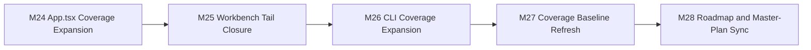

# Roadmap Next (M24-M28)

Updated: 2026-03-10

## Objective

Move the repo from a broad quality uplift to a more defensible, measurable state:
- finish the most valuable `App.tsx` interaction and error-path tests,
- close the remaining workbench helper/runtime tails that were blocking threshold confidence,
- materially improve CLI command-surface coverage in `main.ts`,
- republish the coverage baseline with real post-wave numbers,
- align roadmap and master-plan artifacts with the delivered state.

## Traceability

| Milestone | Issue | Status |
| --- | --- | --- |
| `M24` | `#52` | `DONE` |
| `M25` | `#48` | `DONE` |
| `M26` | `#49` | `DONE` |
| `M27` | `#50` | `DONE` |
| `M28` | `#51` | `DONE` |

## M24: App.tsx Coverage Expansion

Goal: cover the most valuable interactive and error-handling branches in the workbench shell.
Status: `DONE`

Scope:
1. exercise execution error and cancelled-run flows,
2. cover missing copy/repro branches and invalid import/reset interactions,
3. cover control clamping and shared-state bootstrap tails.

Delivered:
1. `packages/workbench/src/appBehavior.test.tsx` now covers execution failure, aborted runs, missing repro bundle handling, and numeric-control clamping,
2. import/reset rejection flows are now exercised deterministically,
3. `packages/workbench/src/appHelpers.test.ts` now covers invalid hash/shared-state fallback behavior.

## M25: Workbench Tail Closure

Goal: remove the remaining workbench coverage risk that was keeping the package near its threshold boundary.
Status: `DONE`

Scope:
1. finish helper/runtime tail coverage,
2. verify the package crosses the local function threshold,
3. keep the tests stable under the current renderer setup.

Delivered:
1. workbench focused tests were extended without production-code churn,
2. `pnpm --filter @cybermasterchef/workbench test:coverage` now reports `96.71%` function coverage,
3. the package now clears its configured local coverage threshold.

## M26: CLI Coverage Expansion

Goal: materially improve coverage of the monolithic CLI entry surface.
Status: `DONE`

Scope:
1. cover `failEmptyOutput`,
2. cover batch summary/report/output-file paths,
3. cover the executable bootstrap path.

Delivered:
1. `packages/cli/test/main.unit.test.ts` now covers empty-output failure handling,
2. batch summary JSON, batch report file generation, and per-file output artifacts are now tested,
3. executable bootstrap via `node --import tsx packages/cli/src/main.ts --version` is now exercised,
4. CLI package coverage improved to `86.27%` statements / `83.33%` functions.

## M27: Coverage Baseline Refresh

Goal: keep quality reporting aligned with the actual post-wave metrics.
Status: `DONE`

Scope:
1. publish the new package-level coverage numbers,
2. document the metric deltas from the previous baseline,
3. update hotspot guidance.

Delivered:
1. `docs/parity/quality-coverage-baseline.md` now reflects the post-M24-M28 metrics,
2. the report captures concrete deltas versus the previous published baseline,
3. hotspot guidance now reflects the new dominant tails in `App.tsx` and `main.ts`.

## M28: Roadmap and Master-Plan Sync

Goal: eliminate planning drift after the M24-M28 quality wave.
Status: `DONE`

Scope:
1. publish the new roadmap artifact,
2. link milestone delivery to GitHub issues,
3. align index/master-plan references with the actual delivered state.

Delivered:
1. this roadmap defines the M24-M28 series end-to-end,
2. `docs/index.md` and `docs/parity/c-implementation-master-plan.md` now reference the M24-M28 quality wave,
3. milestone traceability is captured in-repo and can be replayed from GitHub history.

## Progress Snapshot

- `M24` `[DONE]`: `App.tsx` execution, error, and state-control branches expanded under deterministic tests.
- `M25` `[DONE]`: workbench helper/runtime tails closed enough to clear the local coverage threshold.
- `M26` `[DONE]`: CLI batch, empty-output, and bootstrap paths covered.
- `M27` `[DONE]`: coverage baseline refreshed with post-wave numbers and deltas.
- `M28` `[DONE]`: roadmap and master-plan synchronized with issue traceability.
