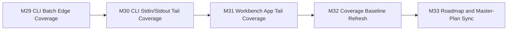

# Roadmap Next (M29-M33)

Updated: 2026-03-10

## Objective

Push the quality wave further without inventing artificial product work:
- close the most valuable remaining batch-path branches in `cli/main.ts`,
- cover stdin/stdout and process-entry behavior through the executable entrypoint,
- extend `App.tsx` interaction coverage into the remaining high-signal state/render tails,
- republish the baseline with the new numbers,
- keep the roadmap and master plan synchronized with the delivered state.

## Traceability

| Milestone | Issue | Status |
| --- | --- | --- |
| `M29` | `#53` | `DONE` |
| `M30` | `#54` | `DONE` |
| `M31` | `#55` | `DONE` |
| `M32` | `#56` | `DONE` |
| `M33` | `#57` | `DONE` |

## M29: CLI Batch Edge Coverage

Goal: exercise the highest-value remaining batch branches in `packages/cli/src/main.ts`.
Status: `DONE`

Scope:
1. cover `batchSkipEmpty`,
2. cover batch read/process failure handling,
3. cover `batchFailFast` with an early error.

Delivered:
1. `packages/cli/test/main.unit.test.ts` now covers skipped empty files, failed directory reads, and fail-fast termination,
2. the batch report payload is now asserted for both error and success rows under direct unit coverage,
3. CLI branch coverage increased materially in the batch section.

## M30: CLI Stdin/Stdout Tail Coverage

Goal: cover the executable entrypoint more like a real user invocation.
Status: `DONE`

Scope:
1. cover stdin-driven execution,
2. cover stdout output without `--output-file`,
3. keep the test deterministic under `tsx`.

Delivered:
1. executable CLI tests now run the real entrypoint with stdin input,
2. stdout output is asserted end-to-end,
3. CLI package coverage improved to `89.97%` statements / `94.44%` functions.

## M31: Workbench App Tail Coverage

Goal: reduce the remaining `App.tsx` interaction and control-state blind spots.
Status: `DONE`

Scope:
1. cover cancel-button behavior during active work,
2. cover finite timeout clamping to max bounds,
3. improve assertions around recipe insertion state.

Delivered:
1. `packages/workbench/src/appBehavior.test.tsx` now covers the active cancel button path,
2. timeout clamping to the configured maximum is asserted explicitly,
3. recipe insertion assertions now verify the concrete inserted operation id,
4. workbench package coverage improved to `90.28%` statements / `97.36%` functions.

## M32: Coverage Baseline Refresh

Goal: publish the post-wave numbers and keep hotspot analysis current.
Status: `DONE`

Scope:
1. refresh package-level metrics,
2. refresh delta reporting,
3. tighten hotspot guidance.

Delivered:
1. `docs/parity/quality-coverage-baseline.md` now reflects the post-M29-M33 numbers,
2. delta reporting now shows movement relative to the M24-M28 baseline,
3. hotspot descriptions were narrowed to the remaining tails in `main.ts` and `App.tsx`.

## M33: Roadmap and Master-Plan Sync

Goal: remove planning drift after the M29-M33 quality wave.
Status: `DONE`

Scope:
1. publish this roadmap artifact,
2. link the delivered milestones to GitHub issues,
3. align the master plan and docs index.

Delivered:
1. this roadmap defines the M29-M33 wave end-to-end,
2. `docs/index.md` and `docs/parity/c-implementation-master-plan.md` now reference M29-M33,
3. issue traceability is now recorded in repo docs for the full wave.

## Progress Snapshot

- `M29` `[DONE]`: CLI batch edge cases covered directly in unit tests.
- `M30` `[DONE]`: real stdin/stdout CLI entrypoint behavior covered under `tsx`.
- `M31` `[DONE]`: `App.tsx` control-state and active-cancel behavior expanded.
- `M32` `[DONE]`: quality baseline refreshed with new coverage metrics.
- `M33` `[DONE]`: roadmap and master-plan synchronized with GitHub issue traceability.
