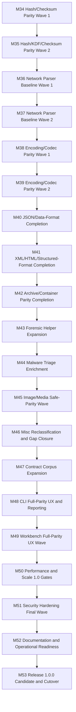

# Roadmap Next (M34-M53)

Updated: 2026-03-11

## Objective

Deliver the remaining execution waves required to reach at least `100%` functional coverage of the tracked CyberChef reference surface and cut release `1.0.0` on top of audited governance, compatibility, and release gates.

## Milestones

1. `M34`: hash/checksum parity wave 1
   - Status: `DONE-IN-CODE`
   - Issue: `#58`
   - add low-risk missing checksum and digest operations
   - update crypto golden/unit coverage and C2 parity counts
2. `M35`: hash/KDF/checksum parity wave 2
   - Status: `DONE-IN-CODE`
   - Issue: `#59`
   - close remaining medium-complexity hash/KDF operations needed for parity
3. `M36`: network parser baseline wave 1
   - Status: `DONE-IN-CODE`
   - Issue: `#60`
   - deliver core IP/range parsing and normalization operations
4. `M37`: network parser baseline wave 2
   - Status: `DONE-IN-CODE`
   - Issue: `#61`
   - close remaining protocol/header parser gaps from the current priority board
5. `M38`: encoding/codec parity wave 1
   - Status: `DONE-IN-CODE`
   - Issue: `#62`
   - close delimiter-aware codec conversion gaps
6. `M39`: encoding/codec parity wave 2
   - Status: `DONE-IN-CODE`
   - Issue: `#63`
   - close remaining canonical representation and content-format transforms
7. `M40`: JSON/data-format completion
   - Status: `PLANNED`
   - Issue: `#64`
   - finish high-priority JSON analysis and normalization tails
8. `M41`: XML/HTML/structured-format completion
   - Status: `PLANNED`
   - Issue: `#65`
   - finish XML/HTML/text-structure parity operations needed for 1.0
9. `M42`: archive/container parity completion
   - Status: `PLANNED`
   - Issue: `#66`
   - close remaining safe archive/container gaps and contract coverage
10. `M43`: forensic helper expansion
    - Status: `PLANNED`
    - Issue: `#67`
    - deliver remaining high-value helper/extractor operations
11. `M44`: malware triage enrichment
    - Status: `PLANNED`
    - Issue: `#68`
    - expand deterministic triage outputs and evidence mapping coverage
12. `M45`: image/media safe-parity wave
    - Status: `PLANNED`
    - Issue: `#69`
    - finish safe browser-compatible image/media operations selected for 1.0
13. `M46`: misc reclassification and gap closure
    - Status: `PLANNED`
    - Issue: `#70`
    - shrink `misc-uncategorized` by classification or implementation
14. `M47`: contract corpus expansion
    - Status: `PLANNED`
    - Issue: `#71`
    - extend C3 generated contracts and corpus to all newly added ops
15. `M48`: CLI full-parity UX and reporting
    - Status: `PLANNED`
    - Issue: `#72`
    - close remaining CLI parity/reporting/documentation tails
16. `M49`: workbench full-parity UX wave
    - Status: `PLANNED`
    - Issue: `#73`
    - close remaining workbench parity gaps for discoverability, editing, and reporting
17. `M50`: performance and scale 1.0 gates
    - Status: `PLANNED`
    - Issue: `#74`
    - final bench/asset/memory budgets aligned with widened functionality
18. `M51`: security hardening final wave
    - Status: `PLANNED`
    - Issue: `#75`
    - final CSP/supply-chain/runtime hardening and dependency review for 1.0
19. `M52`: documentation and operational readiness
    - Status: `PLANNED`
    - Issue: `#76`
    - complete user docs, runbooks, release notes structure, diagrams, onboarding, and container operator docs
20. `M53`: release `1.0.0` candidate and cutover
    - Status: `PLANNED`
    - Issue: `#77`
    - run full gates, freeze, create RC, merge `dev -> main`, build/test/publish GHCR image, and tag `1.0.0`

## Release Target

- Functional target: minimum `100%` coverage against the tracked CyberChef reference operation set.
- Quality target: all parity/security/perf/release gates green on the release candidate.
- Documentation target: README, docs index, roadmap, runbooks, release plan, container docs, and parity artifacts all aligned with the shipped behavior.
- Tracking target: GitHub milestones `M34-M53` published and linked to issues `#58-#77`.

## Current Progress Snapshot

- `M34` `[DONE-IN-CODE]`: added `hash.crc32` and `hash.ripemd160`, regenerated C2 parity artifacts, and advanced the crypto/hash closure track.
- `M35` `[DONE-IN-CODE]`: `hash.fletcher8`, `hash.fletcher16`, `hash.fletcher32`, and `hash.fletcher64` are implemented, tested, and correctly classified into the crypto parity domain.
- `M36` `[DONE-IN-CODE]`: `network.parseIPv6Address`, `network.parseIPRange`, and `network.stripHttpHeaders` are implemented and tested; GitHub milestones `M34-M53` were published and linked to issues `#58-#77`.
- `M37` `[DONE-IN-CODE]`: `network.parseIPv4Header`, `network.parseTcpHeader`, `network.parseUdpHeader`, `network.parseUri`, `network.stripIPv4Header`, `network.stripTcpHeader`, and `network.stripUdpHeader` are implemented and tested, lifting network parity to `22/29` tracked operations.
- `M38` `[DONE-IN-CODE]`: delimiter-aware codec conversions are closed by `codec.fromBinary`, `codec.fromCharcode`, `codec.fromDecimal`, `codec.fromOctal`, `codec.toOctal`, `codec.toMorseCode`, and `codec.fromMorseCode`, with explicit unit coverage for the new delimiter branches.
- `M39` `[DONE-IN-CODE]`: `codec.toBase92`, `codec.fromBase92`, `codec.toBraille`, `codec.fromBraille`, `codec.toPunycode`, `codec.fromPunycode`, `codec.toModhex`, `codec.fromModhex`, `bytes.dropBytes`, `bytes.takeBytes`, `bytes.dropNthBytes`, `bytes.takeNthBytes`, and `bytes.removeNullBytes` are implemented and tested, lifting `encodings-codecs` to `49/58` tracked operations.
- `M40-M53` `[PLANNED]`: not started yet in code; scoped here as the remaining release path to `1.0.0`.
