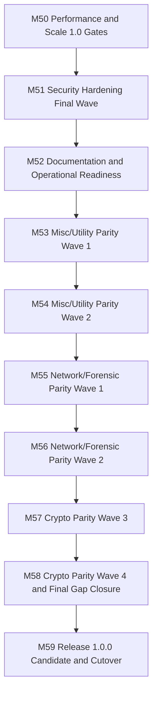

# Roadmap Next (M50-M59)

Updated: 2026-03-11

## Objective

Close the remaining parity gap from `344/465` tracked CyberChef reference operations to at least `100%` while keeping release-quality governance, security, performance, and documentation gates green for `1.0.0`.

## Milestones

1. `M50`: performance and scale 1.0 gates
   - Status: `IN-PROGRESS`
   - Issue: `#74`
   - stabilize benchmark, asset, and CI perf gates against current build output
2. `M51`: security hardening final wave
   - Status: `PLANNED`
   - Issue: `#75`
   - complete runtime/container/security-policy hardening and release-blocking security evidence
3. `M52`: documentation and operational readiness
   - Status: `PLANNED`
   - Issue: `#76`
   - align README, release docs, runbooks, diagrams, container/operator docs, and release evidence
4. `M53`: misc/utility parity wave 1
   - Status: `PLANNED`
   - Issue: `#78`
   - land low-risk arithmetic, formatting, and utility operations from `misc-uncategorized`
5. `M54`: misc/utility parity wave 2
   - Status: `PLANNED`
   - Issue: `#79`
   - close remaining low/medium-complexity text and numeric utility gaps
6. `M55`: network/forensic parity wave 1
   - Status: `PLANNED`
   - Issue: `#80`
   - deliver missing X.509, URL/IP, and deterministic forensic helper operations needed for release parity
7. `M56`: network/forensic parity wave 2
   - Status: `PLANNED`
   - Issue: `#81`
   - close remaining network-protocol and malware-helper tails from the C2 board
8. `M57`: crypto parity wave 3
   - Status: `PLANNED`
   - Issue: `#82`
   - add the next safe crypto/checksum operations with deterministic coverage and contracts
9. `M58`: crypto parity wave 4 and final gap closure
   - Status: `PLANNED`
   - Issue: `#83`
   - take tracked reference coverage to at least `100%` and reconcile final C1/C2/C3 evidence
10. `M59`: release `1.0.0` candidate and cutover
    - Status: `PLANNED`
    - Issue: `#77`
    - run the full release chain, freeze, tag, publish, validate GHCR images, and verify post-release status

## Current Progress Snapshot

- Baseline parity checkpoint entering this wave: `344/465` tracked operations implemented.
- Highest remaining parity pressure domains:
  - `crypto-hash-kdf`: `39/97`
  - `network-protocol-parsers`: `22/39`
  - `forensic-malware-helper`: `10/17`
  - `misc-uncategorized`: `87/119`
- Release blockers entering this wave:
  - release sequencing must move behind the remaining parity closure, not ahead of it
  - performance/security/docs evidence needs to stay current with each parity wave
  - GitHub milestone/issue tracking must expand from `M53` to `M59`

## Exit Criteria

- tracked reference parity at or above `100%`
- `pnpm c1:check`, `pnpm c1:reclassify-check`, `pnpm c2:check`, `pnpm c3:check` green on the release commit
- `pnpm run ci`, `pnpm run ci:full`, `pnpm test:e2e`, `pnpm perf:assets`, `pnpm perf:check`, and `pnpm release:readiness` green
- Docker image built, smoke-tested, and published to `ghcr.io/mkilijanek/cybermasterchef`
- README, docs index, roadmap, runbooks, release notes, and diagrams aligned with shipped behavior
