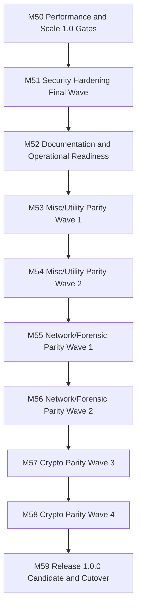

# Roadmap Next (M50-M59)

Updated: 2026-03-11

## Objective

Close the remaining parity gap from `376/465` tracked CyberChef reference operations to at least `100%` while keeping release-quality governance, security, performance, and documentation gates green for `1.0.0`.

## Milestones

1. `M50`: performance and scale 1.0 gates
   - Status: `IN-PROGRESS`
   - Issue: `#74`
   - stabilize benchmark, asset, and CI perf gates against current build output; asset baseline refreshed to `1020000` bytes for `sandbox.worker.js` and Actions forced onto `Node 24`
2. `M51`: security hardening final wave
   - Status: `PLANNED`
   - Issue: `#75`
   - complete runtime/container/security-policy hardening and release-blocking security evidence
3. `M52`: documentation and operational readiness
   - Status: `PLANNED`
   - Issue: `#76`
   - align README, release docs, runbooks, diagrams, container/operator docs, and release evidence
4. `M53`: misc/utility parity wave 1
   - Status: `DONE-IN-CODE`
   - Issue: `#78`
   - landed `text.alternatingCaps`, `math.sum`, `math.subtract`, `math.multiply`, and `math.divide` with full targeted coverage and refreshed `C2/C3`
5. `M54`: misc/utility parity wave 2
   - Status: `DONE-IN-CODE`
   - Issue: `#79`
   - landed `bytes.bitShiftLeft`, `bytes.bitShiftRight`, `text.expandAlphabetRange`, `text.escapeString`, `codec.toFloat`, and `codec.fromFloat` with full targeted coverage and refreshed `C2/C3`
6. `M55`: network/forensic parity wave 1
   - Status: `DONE-IN-CODE`
   - Issue: `#80`
   - landed `network.changeIpFormat`, `network.extractMacAddresses`, and `network.parseUserAgent` with full targeted coverage and refreshed `C2/C3`
7. `M56`: network/forensic parity wave 2
   - Status: `DONE-IN-CODE`
   - Issue: `#81`
   - landed `network.ipv6TransitionAddresses`, `network.parseTlsRecord`, `network.parseX509Certificate`, and `network.parseX509Crl` with full targeted coverage and refreshed `C2/C3`
8. `M57`: crypto parity wave 3
   - Status: `DONE-IN-CODE`
   - Issue: `#82`
   - landed `hash.md4`, `hash.blake3`, `hash.keccak`, and `hash.whirlpool` with full targeted coverage and refreshed `C2/C3`
9. `M58`: crypto parity wave 4 and final gap closure
   - Status: `IN-PROGRESS`
   - Issue: `#83`
   - landed `hash.crc64`, `hash.sm3`, `hash.xxhash32`, `hash.xxhash64`, `hash.xxhash3`, `hash.xxhash128`, `crypto.argon2d`, `crypto.argon2i`, `crypto.argon2id`, and `crypto.argon2Verify`; final parity closure remains open behind further crypto/security waves
10. `M59`: release `1.0.0` candidate and cutover
    - Status: `PLANNED`
    - Issue: `#77`
    - run the full release chain, freeze, tag, publish, validate GHCR images, and verify post-release status

## Current Progress Snapshot

- Baseline parity checkpoint in the current repo state: `376/465` tracked operations implemented.
- Highest remaining parity pressure domains:
  - `crypto-hash-kdf`: `54/100`
  - `network-protocol-parsers`: `28/39`
  - `forensic-malware-helper`: `10/17`
  - `misc-uncategorized`: `96/117`
- Release blockers entering this wave:
  - release sequencing must move behind the remaining parity closure, not ahead of it
  - performance/security/docs evidence needs to stay current with each parity wave
  - GitHub milestone/issue tracking must expand from `M53` to `M59`

## Exit Criteria

- tracked reference parity at or above `100%`
- `pnpm c1:check`, `pnpm c1:reclassify-check`, `pnpm c2:check`, `pnpm c3:check` green on the release commit
- `pnpm run ci`, `pnpm run ci:full`, `pnpm test:e2e`, `pnpm perf:assets`, `pnpm perf:check`, and `pnpm release:readiness` green
- Docker image built, smoke-tested, and published to `ghcr.io/mkilijanek/cybermasterchef`
- README, docs index, roadmap, runbooks, release notes, and diagrams aligned with shipped behavior
