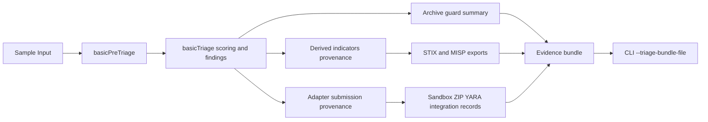

# Triage Evidence Bundle

Updated: 2026-03-10

## Purpose

`forensic.basicTriage` now emits a deterministic `evidenceBundle` plus explicit `provenance` for:

- derived indicators exported to STIX/MISP,
- adapter submissions (`sandbox`, `zipPasswordPipeline`, `yara`),
- archive guard state used to decide whether evidence can be forwarded safely.

The bundle is intended for analyst handoff, replay, and audit without depending on transient stderr logs.

## Flow



## Bundle schema

- `schemaVersion`: currently `1`
- `generatedAt`: deterministic timestamp (`1970-01-01T00:00:00.000Z`)
- `bundleId`: stable hash-derived identifier
- `sample`: input type, size, `sha256`, `md5`
- `score`: triage verdict, normalized risk score, reasons
- `findingIds`: compact list of finding identifiers
- `recommendationCount`: count only, to keep bundle compact
- `exportSummary`: STIX object count and MISP attribute count
- `archiveSummary`: archive format, entry count, encrypted entry count, safe-to-submit state, guard reasons
- `provenance.derivedIndicators`: indicator value, source path, STIX ID, MISP attribute mapping
- `provenance.adapterSubmissions`: attempted status, endpoint, response code, request summary, response summary, error

## CLI export

Single-run CLI execution can persist the bundle directly:

```bash
pnpm --filter @cybermasterchef/cli exec cybermasterchef recipe.json sample.txt \
  --triage-bundle-file triage-bundle.json
```

If the final output is not a `forensic.basicTriage` JSON report, the CLI exits with an error instead of writing an invalid bundle.

## Operational notes

- The evidence bundle is deterministic by design and excludes raw sample bytes.
- Remote adapter provenance records metadata about what was attempted, not the full payload body.
- The main report still contains richer sections (`findings`, `recommendations`, `exports`, `archiveAnalysis`); the bundle is the handoff-oriented subset.
